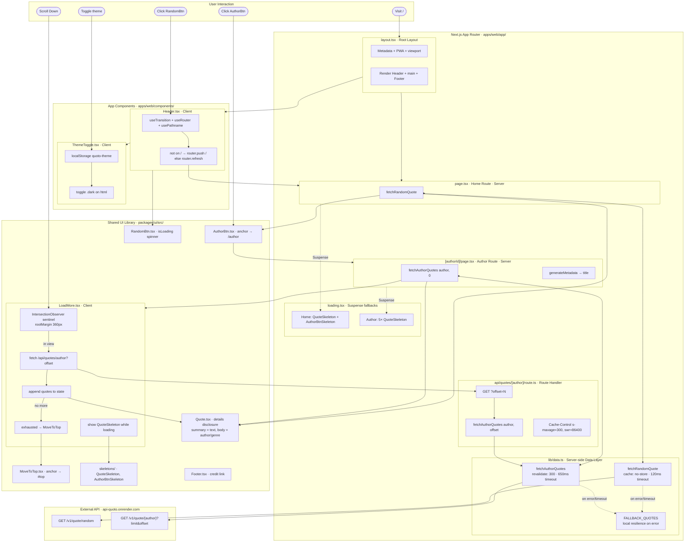

# Quoto App — Code Flow Diagram

## Module Responsibilities

| Module                                          | Type               | Responsibility                                                                                                |
| ----------------------------------------------- | ------------------ | ------------------------------------------------------------------------------------------------------------- |
| `app/layout.tsx`                                | Server             | Root layout: metadata, PWA manifest, viewport; renders Header + main + Footer; defaults to `dark` on `<html>` |
| `app/page.tsx`                                  | Server             | Home route — fetches and displays a random quote + author link                                                |
| `app/[authorId]/page.tsx`                       | Server             | Author route — fetches first page of author quotes; sets title via `generateMetadata`                         |
| `app/api/quotes/[author]/route.ts`              | Route Handler      | Pagination endpoint used by `LoadMore`; wraps `fetchAuthorQuotes`, sets cache headers                         |
| `app/lib/data.ts`                               | Server-side module | API calls with `AbortController` timeouts and local `FALLBACK_QUOTES` on failure                              |
| `app/loading.tsx`, `app/[authorId]/loading.tsx` | Server             | Suspense skeleton fallbacks during route data fetches                                                         |
| `components/Header.tsx`                         | Client             | Nav bar; `useTransition`-driven random refresh (`router.push`/`router.refresh`)                               |
| `components/ThemeToggle.tsx`                    | Client             | Dark/light toggle persisted to `localStorage`; toggles `.dark` on `<html>`                                    |
| `packages/ui/Quote.tsx`                         | Server             | Quote card as a `
` disclosure (text → author/genre)                                                  |
| `packages/ui/AuthorBtn.tsx`                     | Server             | Author link (anchor) with CSS hover affordance                                                                |
| `packages/ui/RandomBtn.tsx`                     | Client             | Random button with loading spinner (`aria-busy`)                                                              |
| `packages/ui/LoadMore.tsx`                      | Client             | Infinite scroll via Intersection Observer; fetches the pagination route                                       |
| `packages/ui/MoveToTop.tsx`                     | Server             | "No more quotes" + scroll-to-top anchor when the list is exhausted                                            |
| `packages/ui/skeletons/`                        | Server             | Loading skeleton placeholders                                                                                 |
| `packages/ui/Footer.tsx`                        | Server             | Footer credit link                                                                                            |

## Data Flow Summary

1. **Home page** — Server calls `fetchRandomQuote()` → renders `Quote` + `AuthorBtn`.
2. **Author page** — Server calls `fetchAuthorQuotes(author, 0)` (first 20) → renders the list + `LoadMore`.
3. **Infinite scroll** — `LoadMore` (client) watches a sentinel via Intersection Observer; on entering view it fetches `GET /api/quotes/{author}?offset=N` (the route handler delegates to `fetchAuthorQuotes`), appends results, and advances the offset by 20. When a page comes back empty it renders `MoveToTop`.
4. **Random refresh** — `Header`'s `RandomBtn` runs inside a `useTransition`: off the home route it `router.push("/")`, otherwise `router.refresh()` re-runs the home server component for a new quote.
5. **Theme** — `ThemeToggle` reads/writes `localStorage["quoto-theme"]` and toggles the `dark` class on `<html>`.

## Caching & Resilience

- **Random quote** uses `cache: "no-store"` — always fresh, never cached.
- **Author quotes** use `next: { revalidate: 300 }`; the API route additionally sets `Cache-Control: public, s-maxage=300, stale-while-revalidate=86400`.
- **Timeouts** — requests are aborted via `AbortController` (random: 120 ms, author: 650 ms). On any error or timeout, `data.ts` returns local `FALLBACK_QUOTES` so the UI never hard-fails.

## Animations

Entrance and disclosure animations are **pure CSS** (Tailwind transitions plus the `quote-details-in` keyframe in `packages/ui/styles.css`) and respect `prefers-reduced-motion`. There is no `framer-motion` dependency.
