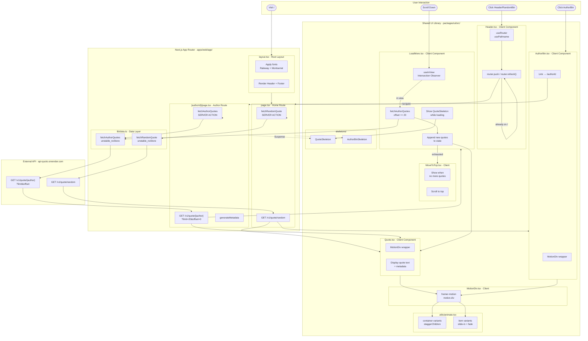

# Quoto App — Code Flow Diagram

## Module Responsibilities

| Module | Type | Responsibility |
|--------|------|---------------|
| `app/layout.tsx` | Server | Root layout: fonts, Header, Footer, metadata, PWA |
| `app/page.tsx` | Server | Home route — fetches and displays a random quote |
| `app/[authorId]/page.tsx` | Server | Author route — fetches and displays paginated author quotes |
| `app/lib/data.ts` | Server Action | All API calls to external quote API (no caching) |
| `components/Header.tsx` | Client | Navigation bar; refresh triggers new random quote |
| `packages/ui/Quote.tsx` | Client | Animated quote card display |
| `packages/ui/AuthorBtn.tsx` | Client | Animated author link button |
| `packages/ui/LoadMore.tsx` | Client | Infinite scroll via Intersection Observer + pagination |
| `packages/ui/MoveToTop.tsx` | Client | Scroll-to-top when quotes list is exhausted |
| `packages/ui/MotionDiv.tsx` | Client | Framer Motion wrapper for entrance animations |
| `packages/ui/utils/animate.tsx` | Util | Shared animation variant configs |
| `packages/ui/skeletons/` | Server | Loading skeleton placeholders |

## Data Flow Summary

1. **Home page** — Server fetches one random quote → renders `Quote` + `AuthorBtn`
2. **Author page** — Server fetches first 20 quotes → renders list + `LoadMore`
3. **Infinite scroll** — `LoadMore` watches viewport; on entering view it fetches the next page (`offset += 20`) and appends quotes
4. **Header click** — `router.refresh()` re-runs the server component, fetching a new random quote
5. **All data fetches** use `unstable_noStore()` — responses are never cached
